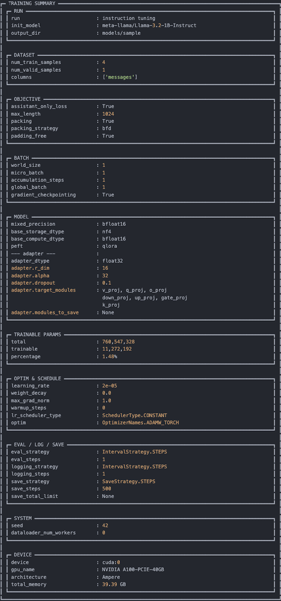

# LLM Instruction Tuning

This repository is a training pipeline for language models. It currently supports instruction tuning, and we plan to expand it to cover a broader range of post-training methods such as RLHF, RLVR, DPO, and so on.

## What This Repository Provides

This repository provides a configurable training pipeline for language model post-training.
It currently supports instruction tuning with LoRA, QLoRA, and LLM.int8-based PEFT.
It also includes DeepSpeed-based multi-GPU training, assistant-only loss, and flexible checkpoint export options.

## Features

*   **Distributed Training**: Supports DeepSpeed training with ZeRO stages 0, 1, 2, and 3. Currently, only multi-GPU training on a single node is supported, with multi-node support planned for the future.
*   **PEFT Support**: Supports LoRA, QLoRA (4-bit), and LLM.int8 (8-bit) fine-tuning.
*   **Assistant-only Loss**: Calculates training loss only on assistant responses by masking user prompts and system instructions based on chat templates.
     * For supervised fine-tuning, we recommend applying the loss only to assistant tokens so that the model learns to generate responses rather than reproduce user prompts or system instructions, following the standard SFT objective:

    $$
    \mathcal{L}_{\mathrm{SFT}}(\theta) = -\mathbb{E}_{(x, y) \sim \mathcal{D}} \sum_{t=1}^{T} \log \pi_{\theta}(y_t \mid x, y_{<t})
    $$

     * Requirement: This feature requires a Jinja2 chat template containing `` and `` tags.
     * Reference: Please refer to the "Train on assistant messages only" section in the [Hugging Face TRL Documentation](https://huggingface.co/docs/trl/sft_trainer#train-on-assistant-messages-only).

## Quick Start

Single-GPU:
```bash
bash scripts/run_single_gpu_train.sh
```

Multi-GPU:
```bash
bash scripts/run_multi_gpu_train.sh
```

Update `configs/models/`, `configs/data/`, and `configs/train/` before running to match your setup.

## Future Work

*   **FSDP Support**: Full support for Fully Sharded Data Parallel (FSDP).
*   **Multi-node Support**: Scaling beyond a single machine.
*   **Preference Tuning**: Support for DPO, ORPO, and others.
*   **RL**: Support for PPO, GRPO, DAPO, and others.

## Project Structure

```text
.
├── chat_templates/      # Jinja templates for assistant-only masking
├── configs/             # YAML/JSON configs for Accelerate, DeepSpeed, Models, and Data
├── data/                # Sample dialogues and dataset loading scripts
├── main.py              # Entry point for training
├── engine.py            # Trainer engine wrapping SFTTrainer
├── model.py             # Model and Tokenizer factories
├── data.py              # Data pipeline and preprocessing logic
├── distributed.py       # Distributed environment helpers
├── ds_utils.py          # DeepSpeed ZeRO-3 specific utilities
├── utils.py             # Logging and parameter utilities
└── scripts/             # Shell scripts for launching training
```

## Dataset Format

The pipeline expects JSONL input. Refer to `data/sample_dialogue/` for more examples.

### Single-turn Example
```json
{"messages": [{"role": "user", "content": "Tell me a joke."}, {"role": "assistant", "content": "Why did the chicken cross the road? To get to the other side."}]}
```

### Multi-turn Example
```json
{"messages": [{"role": "user", "content": "Who is the author of 'Dragon Raja'?"}, {"role": "assistant", "content": "The author is Yeong-do Lee."}, {"role": "user", "content": "What is his other famous work?"}, {"role": "assistant", "content": "He also wrote 'The Bird That Drinks Tears'."}]}
```

## PEFT Configuration Details

PEFT-related options can be configured in `configs/train/train.yaml`.

### Merge option
Set `peft_config.save_with_merge: true` to export a checkpoint with the trained LoRA adapters merged into the base model. If disabled, the repository saves the adapter weights separately.

### LoRA module precision
TRL may implicitly cast LoRA adapter weights when training with QLoRA or LLM.int8. To make this behavior explicit and configurable, this repository allows users to set the adapter precision through `peft_config.enable_lora_fp32`.

## Installation

```bash
pip install -r requirements.txt
```
Note: Flash Attention (v2 or v3) is not included in `requirements.txt`. Please install the version compatible with your specific CUDA environment manually.

## Usage

Training is executed through provided shell scripts. Before running, adjust the configuration files in the `configs/` directory to match your hardware and preferences.

### 1. Configuration
Modify the following files based on your environment:
*   **Accelerate Config**: Files in `configs/accelerate/` (e.g., number of GPUs, mixed precision).
*   **DeepSpeed Config**: Files in `configs/deepspeed/` (e.g., ZeRO stage, offloading).
*   **Training Config**: `configs/train/train.yaml` (e.g., hyperparameters, PEFT settings).

### 2. Execution

#### Single-GPU Training
For single-GPU setups, it is recommended to use DeepSpeed Stage 0. 
1. Set `distributed_type: deepspeed` in your training config.
2. Set the `deepspeed` path to `configs/deepspeed/default/ds_stage0.json`.
3. Run the script:
```bash
bash run_single_gpu_train.sh
```

#### Multi-GPU Training
For multi-GPU setups, adjust the `CUDA_VISIBLE_DEVICES` and `ACCELERATE_CFG` in the script to match your preference.
```bash
bash run_multi_gpu_train.sh
```

## Training Summary

<p align="center">
  
</p>
